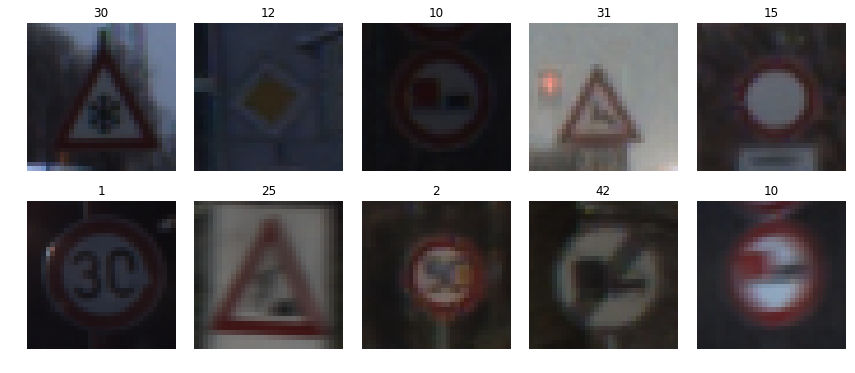
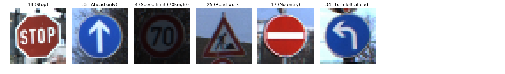

# Writeup of the Project: Build a Traffic Sign Recognition Classifier


The goals / steps of this project are the following:
* Load the data set (see below for links to the project data set)
* Explore, summarize and visualize the data set
* Design, train and test a model architecture
* Use the model to make predictions on new images
* Analyze the softmax probabilities of the new images
* Summarize the results with a written report

--------

## Rubric Points
### Here I will consider the rubric points individually and describe how I addressed each point in my implementation.  

---
## 1. Dataset Exploration
### 1-1. Dataset summary

Afer loading the pickled data for training, validation and testing,I used the numpy library to calculate summary statistics of the traffic signs data set:


The size of training set is 34799.  
The size of the validation set is 4410.  
The size of test set is 12630.  
The shape of a traffic sign image is RGB color image of 32 pixels by 32 pixels.   
The number of unique classes/labels in the data set is 43.


```python
# Load pickled data
import pickle

# TODO: Fill this in based on where you saved the training and testing data

training_file = "../data/train.p"
validation_file= "../data/valid.p"
testing_file = "../data/test.p"

with open(training_file, mode='rb') as f:
    train = pickle.load(f)
with open(validation_file, mode='rb') as f:
    valid = pickle.load(f)
with open(testing_file, mode='rb') as f:
    test = pickle.load(f)
    
X_train, y_train = train['features'], train['labels']
X_valid, y_valid = valid['features'], valid['labels']
X_test, y_test = test['features'], test['labels']

print("X_train shape:", X_train.shape)
print("y_train shape:", y_train.shape)
print("X_valid shape:", X_valid.shape)
print("y_valid shape:", y_valid.shape)
print("X_test shape:", X_test.shape)
print("y_test shape:", y_test.shape)
```

    X_train shape: (34799, 32, 32, 3)
    y_train shape: (34799,)
    X_valid shape: (4410, 32, 32, 3)
    y_valid shape: (4410,)
    X_test shape: (12630, 32, 32, 3)
    y_test shape: (12630,)


```python
### Replace each question mark with the appropriate value. 
### Use python, pandas or numpy methods rather than hard coding the results
import numpy as np

# TODO: Number of training examples
n_train = len(X_train)

# TODO: Number of validation examples
n_validation = len(X_valid)

# TODO: Number of testing examples.
n_test = len(X_test)

# TODO: What's the shape of an traffic sign image?
image_shape = X_train[0].shape

# TODO: How many unique classes/labels there are in the dataset.
n_classes = len(np.unique(y_train))

print("Number of training examples =",n_train)
print("Number of validation examples=",n_validation)
print("Number of testing examples =",n_test)
print("Image data shape =",image_shape)
print("Number of classes =",n_classes)
```

    Number of training examples = 34799
    Number of validation examples= 4410
    Number of testing examples = 12630
    Image data shape = (32, 32, 3)
    Number of classes = 43


### 1-2. Exploratory visualization

Here I randomly picked up some images and visualized them with each label by using random library.


```python
### Data exploration visualization code goes here.
### Feel free to use as many code cells as needed.
import matplotlib.pyplot as plt
# Visualizations will be shown in the notebook.
%matplotlib inline

import random

# showing 10 random image data
fig, axs = plt.subplots(2,5, figsize=(15, 6))
fig.subplots_adjust(hspace = .2, wspace=.001)
axs = axs.ravel()
for i in range(10):
    index = random.randint(0,X_train.shape[0])
    image = X_train[index]
    axs[i].axis('off')
    axs[i].imshow(image)
    axs[i].set_title(y_train[index])
```





----

## 2. Design and Test a Model Architecture

### 2-1. Preprocessing

As a first step, I decided to convert the images to grayscale by averaging values of RGB channel, in order to reduce the computational load.  
Then, I normalized the train, validation and test datasets by (pixel - 128)/ 128 so that the data has mean zero and equal variance.   
As a final step, I decided to shuffle the examples using shuffle from the sklearn.utils library to secure randomized(non-fixed) initial state.


```python
### Preprocess the data here. It is required to normalize the data. Other preprocessing steps could include 
### converting to grayscale, etc.
### Feel free to use as many code cells as needed.


# Store original data
X_train_org = X_train
X_valid_org = X_valid
X_test_org = X_test

# Convert to grayscale by averaging values of RGB channel
X_train_gray = np.sum(X_train/3, axis=3, keepdims=True)
X_valid_gray = np.sum(X_valid/3, axis=3, keepdims=True)
X_test_gray  = np.sum(X_test/3,  axis=3, keepdims=True)


print('Train data RGB shape:', X_train.shape)
print('Train data Grayscale shape:', X_train_gray.shape)
print('Valid data RGB shape:', X_valid.shape)
print('Valid data Grayscale shape:', X_valid_gray.shape)
print('Test data RGB shape:', X_test.shape)
print('Test data Grayscale shape:', X_test_gray.shape)
```

    Train data RGB shape: (34799, 32, 32, 3)
    Train data Grayscale shape: (34799, 32, 32, 1)
    Valid data RGB shape: (4410, 32, 32, 3)
    Valid data Grayscale shape: (4410, 32, 32, 1)
    Test data RGB shape: (12630, 32, 32, 3)
    Test data Grayscale shape: (12630, 32, 32, 1)


```python
## Normalize the train, validation and test datasets by (pixel - 128)/ 128

X_train = (X_train_gray - 128)/128
X_valid = (X_valid_gray - 128)/128
X_test  = (X_test_gray  - 128)/128

print('Average of normalized Train data:',np.mean(X_train))
print('Average of normalized Validation data:',np.mean(X_valid))
print('Average of normalized Test data:',np.mean(X_test))
```

    Average of normalized Train data: -0.354081335648
    Average of normalized Validation data: -0.347215411128
    Average of normalized Test data: -0.358215153428


```python
# Shuffle training data
from sklearn.utils import shuffle
X_train, y_train = shuffle(X_train, y_train)
```

### 2-2.Model Architecture

My final model consists of the following layers.

|Layer|Explanation|
| -- | ------------------------------------------------- |
|Input|32x32x1 Grayscale image|
|Convolution|1x1 stride, VALID padding, output = 28x28x6 |
| RELU |  |
| Max pooling|2x2 stride, VALID padding, output = 14x14x6 |
| Convolution|1x1 stride, VALID padding, output = 10x10x16 |
| RELU |  |
| Max pooling| 2x2 stride, VALID padding, output = 5x5x16 |
| Flatten| output = 400  |
| Dropout  | 50% dropped |
| Fully connected| output = 120  |
| RELU  |   |
| Dropout  | 50% dropped  |
| Fully connected| output = 84  |
| RELU  |   |
| Dropout  | 50% dropped  |
| Fully connected| output = 43  |


```python
### Define your architecture here.
### Feel free to use as many code cells as needed.
import tensorflow as tf

EPOCHS = 200
BATCH_SIZE = 128
DROPOUT = 0.5
```


```python
x = tf.placeholder(tf.float32, (None, 32, 32, 1))
y = tf.placeholder(tf.int32, (None))
one_hot_y = tf.one_hot(y, n_classes)
keep_prob = tf.placeholder(tf.float32)
```


```python
from tensorflow.contrib.layers import flatten

def LeNet(x):    
    # Arguments used for tf.truncated_normal, randomly defines variables for the weights and biases for each layer
    mu = 0
    sigma = 0.1
    
    # SOLUTION: Layer 1: Convolutional. Input = 32x32x1. Output = 28x28x6.
    conv1_W = tf.Variable(tf.truncated_normal(shape=(5, 5, 1, 6), mean = mu, stddev = sigma))
    conv1_b = tf.Variable(tf.zeros(6))
    conv1   = tf.nn.conv2d(x, conv1_W, strides=[1, 1, 1, 1], padding='VALID') + conv1_b

    # SOLUTION: Activation.
    conv1 = tf.nn.relu(conv1)

    # SOLUTION: Pooling. Input = 28x28x6. Output = 14x14x6.
    conv1 = tf.nn.max_pool(conv1, ksize=[1, 2, 2, 1], strides=[1, 2, 2, 1], padding='VALID')

    # SOLUTION: Layer 2: Convolutional. Output = 10x10x16.
    conv2_W = tf.Variable(tf.truncated_normal(shape=(5, 5, 6, 16), mean = mu, stddev = sigma))
    conv2_b = tf.Variable(tf.zeros(16))
    conv2   = tf.nn.conv2d(conv1, conv2_W, strides=[1, 1, 1, 1], padding='VALID') + conv2_b
    
    # SOLUTION: Activation.
    conv2 = tf.nn.relu(conv2)

    # SOLUTION: Pooling. Input = 10x10x16. Output = 5x5x16.
    conv2 = tf.nn.max_pool(conv2, ksize=[1, 2, 2, 1], strides=[1, 2, 2, 1], padding='VALID')

    # SOLUTION: Flatten. Input = 5x5x16. Output = 400. 
    fc0   = flatten(conv2)
    #addding dropout
    fc0   = tf.nn.dropout(fc0, keep_prob)
    
    # SOLUTION: Layer 3: Fully Connected. Input = 400. Output = 120.
    fc1_W = tf.Variable(tf.truncated_normal(shape=(400, 120), mean = mu, stddev = sigma))
    fc1_b = tf.Variable(tf.zeros(120))
    fc1   = tf.matmul(fc0, fc1_W) + fc1_b
    
    # SOLUTION: Activation. 
    fc1    = tf.nn.relu(fc1)
    #addding dropout
    fc1    = tf.nn.dropout(fc1, keep_prob) 

    # SOLUTION: Layer 4: Fully Connected. Input = 120. Output = 84.
    fc2_W  = tf.Variable(tf.truncated_normal(shape=(120, 84), mean = mu, stddev = sigma))
    fc2_b  = tf.Variable(tf.zeros(84))
    fc2    = tf.matmul(fc1, fc2_W) + fc2_b
    
    # SOLUTION: Activation.
    fc2    = tf.nn.relu(fc2)
    #addding dropout
    fc2    = tf.nn.dropout(fc2, keep_prob) 
    
    
    # SOLUTION: Layer 5: Fully Connected. Input = 84. Output = 43.
    fc3_W  = tf.Variable(tf.truncated_normal(shape=(84, 43), mean = mu, stddev = sigma))
    fc3_b  = tf.Variable(tf.zeros(43))
    logits = tf.matmul(fc2, fc3_W) + fc3_b
    
    return logits
```

### 2-3 Model Training

Basically, I used the provided LeNet function for training the model, except for adding "Dropout" function.

I understood that low accuracy on the training and validation sets imply underfitting,
while too high accuracy on the training set but low accuracy on the validation set implies overfitting.
In order to avoid overfitting, I added dropout function.

### 2-4. Solution Approach

During test and error process, I noticed that more epochs would basically leads to high accuracy although the computing time becomes longer.
So I firstly set sufficient number to "EPOCHS".

Then, I tweaked learning rate, batch size and dropout for several trials, then concluded to use following sets.  
EPOCHS is 200  
BATCH_SIZE is 128  
DROPOUT 50%  
Learning rate is 0.06 %  

#### **Result**  
Training Accuracy = 99.687%  
Validation Accuracy = 96.961%  
Test Accuracy = 95.305%  


```python
### Train your model here.
### Calculate and report the accuracy on the training and validation set.
### Once a final model architecture is selected, 
### the accuracy on the test set should be calculated and reported as well.
### Feel free to use as many code cells as needed.

rate = 0.0006

logits = LeNet(x)
cross_entropy = tf.nn.softmax_cross_entropy_with_logits(labels=one_hot_y, logits=logits)
loss_operation = tf.reduce_mean(cross_entropy)
optimizer = tf.train.AdamOptimizer(learning_rate = rate)
training_operation = optimizer.minimize(loss_operation)
```


```python
correct_prediction = tf.equal(tf.argmax(logits, 1), tf.argmax(one_hot_y, 1))
accuracy_operation = tf.reduce_mean(tf.cast(correct_prediction, tf.float32))
saver = tf.train.Saver()

def evaluate(X_data, y_data):
    num_examples = len(X_data)
    total_accuracy = 0
    sess = tf.get_default_session()
    for offset in range(0, num_examples, BATCH_SIZE):
        batch_x, batch_y = X_data[offset:offset+BATCH_SIZE], y_data[offset:offset+BATCH_SIZE]
        accuracy = sess.run(accuracy_operation, feed_dict={x: batch_x, y: batch_y, keep_prob: 1.0})
        total_accuracy += (accuracy * len(batch_x))
    return total_accuracy / num_examples
```


```python
with tf.Session() as sess:
    sess.run(tf.global_variables_initializer())
    num_examples = len(X_train)
    
    print("Training...")
    print()
    for i in range(EPOCHS):
        X_train, y_train = shuffle(X_train, y_train)
        for offset in range(0, num_examples, BATCH_SIZE):
            end = offset + BATCH_SIZE
            batch_x, batch_y = X_train[offset:end], y_train[offset:end]
            sess.run(training_operation, feed_dict={x: batch_x, y: batch_y, keep_prob: DROPOUT})
        training_accuracy = evaluate(X_train, y_train)            
        validation_accuracy = evaluate(X_valid, y_valid)
        print("EPOCH {} ...".format(i+1))
        print("Training Accuracy = {:.3f}%".format(100*training_accuracy))
        print("Validation Accuracy = {:.3f}%".format(100*validation_accuracy))
        print()
        
    saver.save(sess, 'lenet')
    print("Model saved")
```

    Training...
    
    EPOCH 1 ...
    Training Accuracy = 26.279%
    Validation Accuracy = 20.340%
    
    EPOCH 2 ...
    Training Accuracy = 53.168%
    Validation Accuracy = 48.798%
    
    EPOCH 3 ...
    Training Accuracy = 66.421%
    Validation Accuracy = 60.862%
    
    EPOCH 4 ...
    Training Accuracy = 76.712%
    Validation Accuracy = 70.249%
    
    EPOCH 5 ...
    Training Accuracy = 83.094%
    Validation Accuracy = 77.574%
    
    EPOCH 6 ...
    Training Accuracy = 86.158%
    Validation Accuracy = 80.907%
    
    EPOCH 7 ...
    Training Accuracy = 87.663%
    Validation Accuracy = 81.995%
    
    EPOCH 8 ...
    Training Accuracy = 88.730%
    Validation Accuracy = 84.082%
    
    EPOCH 9 ...
    Training Accuracy = 90.158%
    Validation Accuracy = 85.873%
    
    EPOCH 10 ...
    Training Accuracy = 91.715%
    Validation Accuracy = 87.234%
    
    EPOCH 11 ...
    Training Accuracy = 92.451%
    Validation Accuracy = 88.118%
    
    EPOCH 12 ...
    Training Accuracy = 92.862%
    Validation Accuracy = 87.823%
    
    EPOCH 13 ...
    Training Accuracy = 93.123%
    Validation Accuracy = 89.297%
    
    EPOCH 14 ...
    Training Accuracy = 93.445%
    Validation Accuracy = 89.478%
    
    EPOCH 15 ...
    Training Accuracy = 93.816%
    Validation Accuracy = 89.932%
    
    EPOCH 16 ...
    Training Accuracy = 94.273%
    Validation Accuracy = 90.816%
    
    EPOCH 17 ...
    Training Accuracy = 95.256%
    Validation Accuracy = 90.862%
    
    EPOCH 18 ...
    Training Accuracy = 95.187%
    Validation Accuracy = 91.769%
    
    EPOCH 19 ...
    Training Accuracy = 94.833%
    Validation Accuracy = 90.794%
    
    EPOCH 20 ...
    Training Accuracy = 95.313%
    Validation Accuracy = 91.746%
    
    EPOCH 21 ...
    Training Accuracy = 95.845%
    Validation Accuracy = 92.494%
    
    EPOCH 22 ...
    Training Accuracy = 96.106%
    Validation Accuracy = 92.540%
    
    EPOCH 23 ...
    Training Accuracy = 96.184%
    Validation Accuracy = 92.812%
    
    EPOCH 24 ...
    Training Accuracy = 96.434%
    Validation Accuracy = 92.336%
    
    EPOCH 25 ...
    Training Accuracy = 96.109%
    Validation Accuracy = 91.746%
    
    EPOCH 26 ...
    Training Accuracy = 96.822%
    Validation Accuracy = 92.562%
    
    EPOCH 27 ...
    Training Accuracy = 96.948%
    Validation Accuracy = 93.016%
    
    EPOCH 28 ...
    Training Accuracy = 97.333%
    Validation Accuracy = 93.492%
    
    EPOCH 29 ...
    Training Accuracy = 97.511%
    Validation Accuracy = 93.605%
    
    EPOCH 30 ...
    Training Accuracy = 97.322%
    Validation Accuracy = 93.220%
    
    EPOCH 31 ...
    Training Accuracy = 97.310%
    Validation Accuracy = 92.948%
    
    EPOCH 32 ...
    Training Accuracy = 97.448%
    Validation Accuracy = 93.061%
    
    EPOCH 33 ...
    Training Accuracy = 97.882%
    Validation Accuracy = 94.104%
    
    EPOCH 34 ...
    Training Accuracy = 97.649%
    Validation Accuracy = 93.492%
    
    EPOCH 35 ...
    Training Accuracy = 97.925%
    Validation Accuracy = 93.764%
    
    EPOCH 36 ...
    Training Accuracy = 97.919%
    Validation Accuracy = 94.467%
    
    EPOCH 37 ...
    Training Accuracy = 97.908%
    Validation Accuracy = 93.741%
    
    EPOCH 38 ...
    Training Accuracy = 98.287%
    Validation Accuracy = 94.626%
    
    EPOCH 39 ...
    Training Accuracy = 98.017%
    Validation Accuracy = 94.263%
    
    EPOCH 40 ...
    Training Accuracy = 98.144%
    Validation Accuracy = 94.082%
    
    EPOCH 41 ...
    Training Accuracy = 98.221%
    Validation Accuracy = 93.968%
    
    EPOCH 42 ...
    Training Accuracy = 98.500%
    Validation Accuracy = 94.444%
    
    EPOCH 43 ...
    Training Accuracy = 98.152%
    Validation Accuracy = 94.059%
    
    EPOCH 44 ...
    Training Accuracy = 98.460%
    Validation Accuracy = 94.649%
    
    EPOCH 45 ...
    Training Accuracy = 98.497%
    Validation Accuracy = 95.147%
    
    EPOCH 46 ...
    Training Accuracy = 98.667%
    Validation Accuracy = 94.989%
    
    EPOCH 47 ...
    Training Accuracy = 98.437%
    Validation Accuracy = 94.807%
    
    EPOCH 48 ...
    Training Accuracy = 98.454%
    Validation Accuracy = 94.853%
    
    EPOCH 49 ...
    Training Accuracy = 98.756%
    Validation Accuracy = 95.918%
    
    EPOCH 50 ...
    Training Accuracy = 98.707%
    Validation Accuracy = 95.488%
    
    EPOCH 51 ...
    Training Accuracy = 98.721%
    Validation Accuracy = 95.782%
    
    EPOCH 52 ...
    Training Accuracy = 98.825%
    Validation Accuracy = 95.578%
    
    EPOCH 53 ...
    Training Accuracy = 98.859%
    Validation Accuracy = 95.828%
    
    EPOCH 54 ...
    Training Accuracy = 98.960%
    Validation Accuracy = 95.329%
    
    EPOCH 55 ...
    Training Accuracy = 98.882%
    Validation Accuracy = 95.351%
    
    EPOCH 56 ...
    Training Accuracy = 98.960%
    Validation Accuracy = 95.850%
    
    EPOCH 57 ...
    Training Accuracy = 99.014%
    Validation Accuracy = 95.556%
    
    EPOCH 58 ...
    Training Accuracy = 98.810%
    Validation Accuracy = 95.351%
    
    EPOCH 59 ...
    Training Accuracy = 99.043%
    Validation Accuracy = 96.259%
    
    EPOCH 60 ...
    Training Accuracy = 99.075%
    Validation Accuracy = 96.122%
    
    EPOCH 61 ...
    Training Accuracy = 99.060%
    Validation Accuracy = 96.463%
    
    EPOCH 62 ...
    Training Accuracy = 99.124%
    Validation Accuracy = 95.828%
    
    EPOCH 63 ...
    Training Accuracy = 99.092%
    Validation Accuracy = 96.508%
    
    EPOCH 64 ...
    Training Accuracy = 99.057%
    Validation Accuracy = 96.190%
    
    EPOCH 65 ...
    Training Accuracy = 99.080%
    Validation Accuracy = 95.669%
    
    EPOCH 66 ...
    Training Accuracy = 99.083%
    Validation Accuracy = 95.896%
    
    EPOCH 67 ...
    Training Accuracy = 99.089%
    Validation Accuracy = 96.077%
    
    EPOCH 68 ...
    Training Accuracy = 99.132%
    Validation Accuracy = 96.236%
    
    EPOCH 69 ...
    Training Accuracy = 99.170%
    Validation Accuracy = 96.236%
    
    EPOCH 70 ...
    Training Accuracy = 99.103%
    Validation Accuracy = 95.805%
    
    EPOCH 71 ...
    Training Accuracy = 99.187%
    Validation Accuracy = 96.032%
    
    EPOCH 72 ...
    Training Accuracy = 99.221%
    Validation Accuracy = 96.145%
    
    EPOCH 73 ...
    Training Accuracy = 99.193%
    Validation Accuracy = 96.190%
    
    EPOCH 74 ...
    Training Accuracy = 99.132%
    Validation Accuracy = 96.145%
    
    EPOCH 75 ...
    Training Accuracy = 99.152%
    Validation Accuracy = 96.190%
    
    EPOCH 76 ...
    Training Accuracy = 99.236%
    Validation Accuracy = 96.372%
    
    EPOCH 77 ...
    Training Accuracy = 99.132%
    Validation Accuracy = 95.737%
    
    EPOCH 78 ...
    Training Accuracy = 99.319%
    Validation Accuracy = 96.621%
    
    EPOCH 79 ...
    Training Accuracy = 99.313%
    Validation Accuracy = 96.349%
    
    EPOCH 80 ...
    Training Accuracy = 99.238%
    Validation Accuracy = 96.485%
    
    EPOCH 81 ...
    Training Accuracy = 99.359%
    Validation Accuracy = 96.395%
    
    EPOCH 82 ...
    Training Accuracy = 99.325%
    Validation Accuracy = 96.644%
    
    EPOCH 83 ...
    Training Accuracy = 99.290%
    Validation Accuracy = 96.621%
    
    EPOCH 84 ...
    Training Accuracy = 99.342%
    Validation Accuracy = 96.372%
    
    EPOCH 85 ...
    Training Accuracy = 99.353%
    Validation Accuracy = 96.440%
    
    EPOCH 86 ...
    Training Accuracy = 99.359%
    Validation Accuracy = 96.395%
    
    EPOCH 87 ...
    Training Accuracy = 99.345%
    Validation Accuracy = 96.372%
    
    EPOCH 88 ...
    Training Accuracy = 99.319%
    Validation Accuracy = 96.168%
    
    EPOCH 89 ...
    Training Accuracy = 99.106%
    Validation Accuracy = 96.122%
    
    EPOCH 90 ...
    Training Accuracy = 99.282%
    Validation Accuracy = 96.508%
    
    EPOCH 91 ...
    Training Accuracy = 99.261%
    Validation Accuracy = 96.485%
    
    EPOCH 92 ...
    Training Accuracy = 99.359%
    Validation Accuracy = 96.190%
    
    EPOCH 93 ...
    Training Accuracy = 99.371%
    Validation Accuracy = 96.553%
    
    EPOCH 94 ...
    Training Accuracy = 99.451%
    Validation Accuracy = 96.644%
    
    EPOCH 95 ...
    Training Accuracy = 99.428%
    Validation Accuracy = 96.395%
    
    EPOCH 96 ...
    Training Accuracy = 99.434%
    Validation Accuracy = 96.621%
    
    EPOCH 97 ...
    Training Accuracy = 99.307%
    Validation Accuracy = 96.349%
    
    EPOCH 98 ...
    Training Accuracy = 99.425%
    Validation Accuracy = 96.440%
    
    EPOCH 99 ...
    Training Accuracy = 99.385%
    Validation Accuracy = 96.327%
    
    EPOCH 100 ...
    Training Accuracy = 99.371%
    Validation Accuracy = 96.508%
    
    EPOCH 101 ...
    Training Accuracy = 99.325%
    Validation Accuracy = 96.009%
    
    EPOCH 102 ...
    Training Accuracy = 99.437%
    Validation Accuracy = 96.712%
    
    EPOCH 103 ...
    Training Accuracy = 99.397%
    Validation Accuracy = 96.145%
    
    EPOCH 104 ...
    Training Accuracy = 99.509%
    Validation Accuracy = 96.644%
    
    EPOCH 105 ...
    Training Accuracy = 99.457%
    Validation Accuracy = 96.395%
    
    EPOCH 106 ...
    Training Accuracy = 99.437%
    Validation Accuracy = 96.304%
    
    EPOCH 107 ...
    Training Accuracy = 99.463%
    Validation Accuracy = 96.576%
    
    EPOCH 108 ...
    Training Accuracy = 99.325%
    Validation Accuracy = 96.485%
    
    EPOCH 109 ...
    Training Accuracy = 99.509%
    Validation Accuracy = 96.621%
    
    EPOCH 110 ...
    Training Accuracy = 99.448%
    Validation Accuracy = 96.304%
    
    EPOCH 111 ...
    Training Accuracy = 99.345%
    Validation Accuracy = 96.531%
    
    EPOCH 112 ...
    Training Accuracy = 99.500%
    Validation Accuracy = 96.508%
    
    EPOCH 113 ...
    Training Accuracy = 99.382%
    Validation Accuracy = 96.213%
    
    EPOCH 114 ...
    Training Accuracy = 99.477%
    Validation Accuracy = 96.689%
    
    EPOCH 115 ...
    Training Accuracy = 99.511%
    Validation Accuracy = 96.576%
    
    EPOCH 116 ...
    Training Accuracy = 99.503%
    Validation Accuracy = 96.712%
    
    EPOCH 117 ...
    Training Accuracy = 99.500%
    Validation Accuracy = 96.712%
    
    EPOCH 118 ...
    Training Accuracy = 99.497%
    Validation Accuracy = 96.531%
    
    EPOCH 119 ...
    Training Accuracy = 99.486%
    Validation Accuracy = 96.803%
    
    EPOCH 120 ...
    Training Accuracy = 99.408%
    Validation Accuracy = 96.984%
    
    EPOCH 121 ...
    Training Accuracy = 99.555%
    Validation Accuracy = 96.735%
    
    EPOCH 122 ...
    Training Accuracy = 99.546%
    Validation Accuracy = 96.689%
    
    EPOCH 123 ...
    Training Accuracy = 99.514%
    Validation Accuracy = 96.463%
    
    EPOCH 124 ...
    Training Accuracy = 99.509%
    Validation Accuracy = 96.553%
    
    EPOCH 125 ...
    Training Accuracy = 99.454%
    Validation Accuracy = 96.780%
    
    EPOCH 126 ...
    Training Accuracy = 99.534%
    Validation Accuracy = 96.531%
    
    EPOCH 127 ...
    Training Accuracy = 99.537%
    Validation Accuracy = 96.939%
    
    EPOCH 128 ...
    Training Accuracy = 99.560%
    Validation Accuracy = 96.553%
    
    EPOCH 129 ...
    Training Accuracy = 99.549%
    Validation Accuracy = 96.621%
    
    EPOCH 130 ...
    Training Accuracy = 99.282%
    Validation Accuracy = 96.122%
    
    EPOCH 131 ...
    Training Accuracy = 99.563%
    Validation Accuracy = 96.553%
    
    EPOCH 132 ...
    Training Accuracy = 99.523%
    Validation Accuracy = 96.553%
    
    EPOCH 133 ...
    Training Accuracy = 99.457%
    Validation Accuracy = 96.599%
    
    EPOCH 134 ...
    Training Accuracy = 99.540%
    Validation Accuracy = 96.712%
    
    EPOCH 135 ...
    Training Accuracy = 99.540%
    Validation Accuracy = 96.349%
    
    EPOCH 136 ...
    Training Accuracy = 99.569%
    Validation Accuracy = 96.576%
    
    EPOCH 137 ...
    Training Accuracy = 99.534%
    Validation Accuracy = 96.825%
    
    EPOCH 138 ...
    Training Accuracy = 99.468%
    Validation Accuracy = 96.621%
    
    EPOCH 139 ...
    Training Accuracy = 99.514%
    Validation Accuracy = 96.735%
    
    EPOCH 140 ...
    Training Accuracy = 99.457%
    Validation Accuracy = 96.689%
    
    EPOCH 141 ...
    Training Accuracy = 99.578%
    Validation Accuracy = 96.667%
    
    EPOCH 142 ...
    Training Accuracy = 99.578%
    Validation Accuracy = 96.553%
    
    EPOCH 143 ...
    Training Accuracy = 99.534%
    Validation Accuracy = 96.508%
    
    EPOCH 144 ...
    Training Accuracy = 99.543%
    Validation Accuracy = 96.712%
    
    EPOCH 145 ...
    Training Accuracy = 99.580%
    Validation Accuracy = 96.712%
    
    EPOCH 146 ...
    Training Accuracy = 99.566%
    Validation Accuracy = 96.780%
    
    EPOCH 147 ...
    Training Accuracy = 99.560%
    Validation Accuracy = 96.667%
    
    EPOCH 148 ...
    Training Accuracy = 99.560%
    Validation Accuracy = 96.735%
    
    EPOCH 149 ...
    Training Accuracy = 99.592%
    Validation Accuracy = 96.553%
    
    EPOCH 150 ...
    Training Accuracy = 99.534%
    Validation Accuracy = 96.327%
    
    EPOCH 151 ...
    Training Accuracy = 99.575%
    Validation Accuracy = 96.667%
    
    EPOCH 152 ...
    Training Accuracy = 99.566%
    Validation Accuracy = 96.599%
    
    EPOCH 153 ...
    Training Accuracy = 99.575%
    Validation Accuracy = 96.803%
    
    EPOCH 154 ...
    Training Accuracy = 99.583%
    Validation Accuracy = 96.735%
    
    EPOCH 155 ...
    Training Accuracy = 99.621%
    Validation Accuracy = 96.621%
    
    EPOCH 156 ...
    Training Accuracy = 99.615%
    Validation Accuracy = 96.735%
    
    EPOCH 157 ...
    Training Accuracy = 99.520%
    Validation Accuracy = 96.281%
    
    EPOCH 158 ...
    Training Accuracy = 99.589%
    Validation Accuracy = 96.757%
    
    EPOCH 159 ...
    Training Accuracy = 99.563%
    Validation Accuracy = 96.054%
    
    EPOCH 160 ...
    Training Accuracy = 99.606%
    Validation Accuracy = 96.667%
    
    EPOCH 161 ...
    Training Accuracy = 99.609%
    Validation Accuracy = 96.825%
    
    EPOCH 162 ...
    Training Accuracy = 99.552%
    Validation Accuracy = 96.213%
    
    EPOCH 163 ...
    Training Accuracy = 99.595%
    Validation Accuracy = 96.712%
    
    EPOCH 164 ...
    Training Accuracy = 99.618%
    Validation Accuracy = 96.576%
    
    EPOCH 165 ...
    Training Accuracy = 99.647%
    Validation Accuracy = 96.712%
    
    EPOCH 166 ...
    Training Accuracy = 99.566%
    Validation Accuracy = 96.485%
    
    EPOCH 167 ...
    Training Accuracy = 99.644%
    Validation Accuracy = 96.848%
    
    EPOCH 168 ...
    Training Accuracy = 99.632%
    Validation Accuracy = 96.848%
    
    EPOCH 169 ...
    Training Accuracy = 99.601%
    Validation Accuracy = 96.667%
    
    EPOCH 170 ...
    Training Accuracy = 99.615%
    Validation Accuracy = 96.757%
    
    EPOCH 171 ...
    Training Accuracy = 99.615%
    Validation Accuracy = 96.780%
    
    EPOCH 172 ...
    Training Accuracy = 99.647%
    Validation Accuracy = 96.803%
    
    EPOCH 173 ...
    Training Accuracy = 99.612%
    Validation Accuracy = 96.644%
    
    EPOCH 174 ...
    Training Accuracy = 99.635%
    Validation Accuracy = 96.712%
    
    EPOCH 175 ...
    Training Accuracy = 99.615%
    Validation Accuracy = 96.644%
    
    EPOCH 176 ...
    Training Accuracy = 99.445%
    Validation Accuracy = 96.553%
    
    EPOCH 177 ...
    Training Accuracy = 99.644%
    Validation Accuracy = 96.961%
    
    EPOCH 178 ...
    Training Accuracy = 99.661%
    Validation Accuracy = 96.825%
    
    EPOCH 179 ...
    Training Accuracy = 99.632%
    Validation Accuracy = 96.485%
    
    EPOCH 180 ...
    Training Accuracy = 99.537%
    Validation Accuracy = 96.916%
    
    EPOCH 181 ...
    Training Accuracy = 99.655%
    Validation Accuracy = 96.644%
    
    EPOCH 182 ...
    Training Accuracy = 99.520%
    Validation Accuracy = 96.531%
    
    EPOCH 183 ...
    Training Accuracy = 99.670%
    Validation Accuracy = 96.735%
    
    EPOCH 184 ...
    Training Accuracy = 99.621%
    Validation Accuracy = 96.621%
    
    EPOCH 185 ...
    Training Accuracy = 99.609%
    Validation Accuracy = 96.667%
    
    EPOCH 186 ...
    Training Accuracy = 99.621%
    Validation Accuracy = 96.667%
    
    EPOCH 187 ...
    Training Accuracy = 99.655%
    Validation Accuracy = 96.848%
    
    EPOCH 188 ...
    Training Accuracy = 99.635%
    Validation Accuracy = 96.803%
    
    EPOCH 189 ...
    Training Accuracy = 99.672%
    Validation Accuracy = 96.848%
    
    EPOCH 190 ...
    Training Accuracy = 99.586%
    Validation Accuracy = 96.825%
    
    EPOCH 191 ...
    Training Accuracy = 99.652%
    Validation Accuracy = 96.757%
    
    EPOCH 192 ...
    Training Accuracy = 99.655%
    Validation Accuracy = 97.029%
    
    EPOCH 193 ...
    Training Accuracy = 99.626%
    Validation Accuracy = 96.848%
    
    EPOCH 194 ...
    Training Accuracy = 99.678%
    Validation Accuracy = 96.916%
    
    EPOCH 195 ...
    Training Accuracy = 99.601%
    Validation Accuracy = 96.735%
    
    EPOCH 196 ...
    Training Accuracy = 99.658%
    Validation Accuracy = 97.120%
    
    EPOCH 197 ...
    Training Accuracy = 99.652%
    Validation Accuracy = 97.211%
    
    EPOCH 198 ...
    Training Accuracy = 99.589%
    Validation Accuracy = 97.234%
    
    EPOCH 199 ...
    Training Accuracy = 99.681%
    Validation Accuracy = 96.984%
    
    EPOCH 200 ...
    Training Accuracy = 99.687%
    Validation Accuracy = 96.961%
    
    Model saved


```python
with tf.Session() as sess:
    saver.restore(sess, tf.train.latest_checkpoint('.'))
    
    test_accuracy = evaluate(X_test, y_test)
    print("Test Accuracy = {:.3f}%".format(100*test_accuracy))
```

    INFO:tensorflow:Restoring parameters from ./lenet
    Test Accuracy = 95.305%


---
## 3: Test a Model on New Images

### 3-1. Acquiring New Images

I picked up some PNG format images from web.  
These are not specially difficult for the model to classify,   
but I assumed that original data format difference might be difficult for the model.

After loading the png file, I converted color channel from BGR to RGB and resize them to 32x32.


```python
### Load the images and plot them here.
### Feel free to use as many code cells as needed.
import numpy as np
import matplotlib.pyplot as plt
import matplotlib.image as mpimg
import cv2
import glob

original_data_folder = 'original_pics_from_web/'
    
org_X_test = []
org_Y_test = []
for image_file in glob.glob(original_data_folder + "*.png"):
    image = cv2.imread(image_file)
    image = cv2.cvtColor(image, cv2.COLOR_BGR2RGB)
    image = cv2.resize(image, (32, 32))
    try:
        # the label is encoded into the first two characters of the file names
        label_str = image_file[len(original_data_folder):][:2]
        label = int(label_str)
        org_X_test.append(image)
        org_Y_test.append(label)
    except  Exception:
        print ('Ignoring image {}'.format(image_file))

#-------------------------------------
# read the semantics of the numbers
import csv
import random
# Visualizations will be shown in the notebook.
%matplotlib inline

classId2SignName = {}

with open('signnames.csv') as csvfile:
    reader = csv.reader(csvfile)
    for row in reader:
        classId2SignName[row[0]] = row[1]


def imagevisualizer(images,labels):
    n_columns = 8
    n_rows = int(len(images)/n_columns)+1
    width = 24
    height = n_rows * 3
    fig, axs = plt.subplots(n_rows,n_columns, figsize=(width, height))
    fig.subplots_adjust(hspace = .2, wspace=.1)
    axs = axs.ravel()
    for i in range(n_columns * n_rows):
        axs[i].axis('off')
        if (i<len(images)):
            image = images[i]
            axs[i].axis('off')
            axs[i].imshow(image)
            axs[i].set_title('{} ({:.20})'.format(labels[i], classId2SignName[str(labels[i])]))
 

imagevisualizer(org_X_test, org_Y_test)

```


### 3-2. Performance on New Images

Contrary to my assumption, the model perfectly classify the captured PNG images.  
Compared to the test accuracy(95.305%), performance on new images(100%) are much better.


```python
### Run the predictions here and use the model to output the prediction for each image.
### Make sure to pre-process the images with the same pre-processing pipeline used earlier.
### Feel free to use as many code cells as needed.

norm_org_X_test = np.array(org_X_test)
norm_org_X_test = np.sum(norm_org_X_test/3, axis=3, keepdims=True)
norm_org_X_test = (norm_org_X_test - 128)/128

prediction=tf.argmax(logits,1)

with tf.Session() as sess:
    saver.restore(sess, tf.train.latest_checkpoint('.'))
    predictions = sess.run(prediction, feed_dict={x: norm_org_X_test, keep_prob: 1.0})
    imagevisualizer(org_X_test, predictions)
    print(predictions)
    print(org_Y_test)
```

    INFO:tensorflow:Restoring parameters from ./lenet
    [14 35  4 25 17 34]
    [14, 35, 4, 25, 17, 34]





```python
### Calculate the accuracy for these 5 new images. 
### For example, if the model predicted 1 out of 5 signs correctly, it's 20% accurate on these new images.

with tf.Session() as sess:
    saver.restore(sess, tf.train.latest_checkpoint('.'))
    
    original_test_accuracy = evaluate(norm_org_X_test, org_Y_test)
    print("Original Test Accuracy = {:.3f}%".format(100*original_test_accuracy))
```

    INFO:tensorflow:Restoring parameters from ./lenet
    Original Test Accuracy = 100.000%


### 3-3. Model  Certainty - Softmax Probabilities

Out of 6 cropped images from web, 5 images are 100% correctly classified.
Only one image, which is "Speed limit (70km/h)", its softmax probability is not 100%, since other similar speed list sign had got small probabilities.  

Through this result, I became confident that this model works correclty, seeing no misclassification on different type of sign, but left some small probability to similar traffic sign. (still number reccognition is correctly done.)


```python
### Print out the top five softmax probabilities for the predictions on the German traffic sign images found on the web. 
### Feel free to use as many code cells as needed.
softmax_logits = tf.nn.softmax(logits)
top_k=tf.nn.top_k(softmax_logits,5)

with tf.Session() as sess:
    saver.restore(sess, tf.train.latest_checkpoint('.'))
    top_k = sess.run(top_k, feed_dict={x: norm_org_X_test, keep_prob : 1.0})
    
#   Calculate Top_5 softmax probabilities
    probabilities = top_k.values
    indices = top_k.indices

    for i in range(len(indices)):
        for j in range(len(indices[i])):
            index = indices[i][j]
            probability = probabilities[i][j]
            print('{:.8f}% ({} {:.20})'.format(probability*100, index,  classId2SignName[str(index)]))
        print('')

```

    INFO:tensorflow:Restoring parameters from ./lenet
    100.00000000% (14 Stop)
    0.00000000% (34 Turn left ahead)
    0.00000000% (33 Turn right ahead)
    0.00000000% (3 Speed limit (60km/h))
    0.00000000% (1 Speed limit (30km/h))
    
    100.00000000% (35 Ahead only)
    0.00000000% (3 Speed limit (60km/h))
    0.00000000% (36 Go straight or right)
    0.00000000% (34 Turn left ahead)
    0.00000000% (14 Stop)
    
    99.92576241% (4 Speed limit (70km/h))
    0.06195148% (1 Speed limit (30km/h))
    0.01176295% (0 Speed limit (20km/h))
    0.00030980% (8 Speed limit (120km/h)
    0.00020449% (5 Speed limit (80km/h))
    
    100.00000000% (25 Road work)
    0.00000000% (29 Bicycles crossing)
    0.00000000% (22 Bumpy road)
    0.00000000% (20 Dangerous curve to t)
    0.00000000% (38 Keep right)
    
    100.00000000% (17 No entry)
    0.00000000% (14 Stop)
    0.00000000% (38 Keep right)
    0.00000000% (34 Turn left ahead)
    0.00000000% (0 Speed limit (20km/h))
    
    100.00000000% (34 Turn left ahead)
    0.00000007% (38 Keep right)
    0.00000000% (36 Go straight or right)
    0.00000000% (32 End of all speed and)
    0.00000000% (13 Yield)
    


### Project Writeup

Once you have completed the code implementation, document your results in a project writeup using this [template](https://github.com/udacity/CarND-Traffic-Sign-Classifier-Project/blob/master/writeup_template.md) as a guide. The writeup can be in a markdown or pdf file. 

> **Note**: Once you have completed all of the code implementations and successfully answered each question above, you may finalize your work by exporting the iPython Notebook as an HTML document. You can do this by using the menu above and navigating to  \n",
    "**File -> Download as -> HTML (.html)**. Include the finished document along with this notebook as your submission.

---

## Step 4 (Optional): Visualize the Neural Network's State with Test Images

 This Section is not required to complete but acts as an additional excersise for understaning the output of a neural network's weights. While neural networks can be a great learning device they are often referred to as a black box. We can understand what the weights of a neural network look like better by plotting their feature maps. After successfully training your neural network you can see what it's feature maps look like by plotting the output of the network's weight layers in response to a test stimuli image. From these plotted feature maps, it's possible to see what characteristics of an image the network finds interesting. For a sign, maybe the inner network feature maps react with high activation to the sign's boundary outline or to the contrast in the sign's painted symbol.

 Provided for you below is the function code that allows you to get the visualization output of any tensorflow weight layer you want. The inputs to the function should be a stimuli image, one used during training or a new one you provided, and then the tensorflow variable name that represents the layer's state during the training process, for instance if you wanted to see what the [LeNet lab's](https://classroom.udacity.com/nanodegrees/nd013/parts/fbf77062-5703-404e-b60c-95b78b2f3f9e/modules/6df7ae49-c61c-4bb2-a23e-6527e69209ec/lessons/601ae704-1035-4287-8b11-e2c2716217ad/concepts/d4aca031-508f-4e0b-b493-e7b706120f81) feature maps looked like for it's second convolutional layer you could enter conv2 as the tf_activation variable.

For an example of what feature map outputs look like, check out NVIDIA's results in their paper [End-to-End Deep Learning for Self-Driving Cars](https://devblogs.nvidia.com/parallelforall/deep-learning-self-driving-cars/) in the section Visualization of internal CNN State. NVIDIA was able to show that their network's inner weights had high activations to road boundary lines by comparing feature maps from an image with a clear path to one without. Try experimenting with a similar test to show that your trained network's weights are looking for interesting features, whether it's looking at differences in feature maps from images with or without a sign, or even what feature maps look like in a trained network vs a completely untrained one on the same sign image.

<figure>
 
 <figcaption>
 <p></p> 
 <p style="text-align: center;"> Your output should look something like this (above)</p> 
 </figcaption>
</figure>
 <p></p> 


```python
### Visualize your network's feature maps here.
### Feel free to use as many code cells as needed.

# image_input: the test image being fed into the network to produce the feature maps
# tf_activation: should be a tf variable name used during your training procedure that represents the calculated state of a specific weight layer
# activation_min/max: can be used to view the activation contrast in more detail, by default matplot sets min and max to the actual min and max values of the output
# plt_num: used to plot out multiple different weight feature map sets on the same block, just extend the plt number for each new feature map entry

def outputFeatureMap(image_input, tf_activation, activation_min=-1, activation_max=-1 ,plt_num=1):
    # Here make sure to preprocess your image_input in a way your network expects
    # with size, normalization, ect if needed
    # image_input =
    # Note: x should be the same name as your network's tensorflow data placeholder variable
    # If you get an error tf_activation is not defined it may be having trouble accessing the variable from inside a function
    activation = tf_activation.eval(session=sess,feed_dict={x : image_input})
    featuremaps = activation.shape[3]
    plt.figure(plt_num, figsize=(15,15))
    for featuremap in range(featuremaps):
        plt.subplot(6,8, featuremap+1) # sets the number of feature maps to show on each row and column
        plt.title('FeatureMap ' + str(featuremap)) # displays the feature map number
        if activation_min != -1 & activation_max != -1:
            plt.imshow(activation[0,:,:, featuremap], interpolation="nearest", vmin =activation_min, vmax=activation_max, cmap="gray")
        elif activation_max != -1:
            plt.imshow(activation[0,:,:, featuremap], interpolation="nearest", vmax=activation_max, cmap="gray")
        elif activation_min !=-1:
            plt.imshow(activation[0,:,:, featuremap], interpolation="nearest", vmin=activation_min, cmap="gray")
        else:
            plt.imshow(activation[0,:,:, featuremap], interpolation="nearest", cmap="gray")
```
